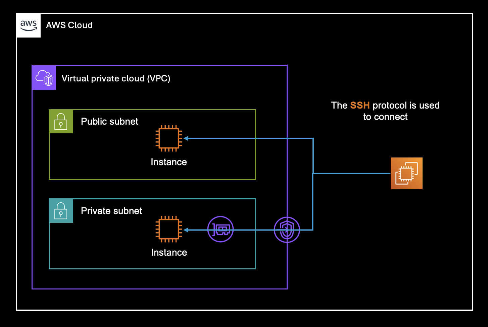

I am using the two ways in the below diagram to access an ec2 instance 

Videos I got to get inspiration from 

[Connect to EC2 with Session Manager and EC2 Instance Connect](https://www.youtube.com/watch?v=3tKB947rT5Q)

[AWS System Manager to Manage Private EC2 Instances without Internet Access | SSM | Private EC2 | VPC](https://www.youtube.com/watch?v=lYJjw7l8Scs)

[Powerpoint presentation with the diagram](https://drive.google.com/file/d/1Bop77OQg0AyKgtzOJOCUs41bLG5l5Tf-/view?usp=sharing) 

[openid connect set up guide](https://mahendranp.medium.com/configure-github-openid-connect-oidc-provider-in-aws-b7af1bca97dd)
