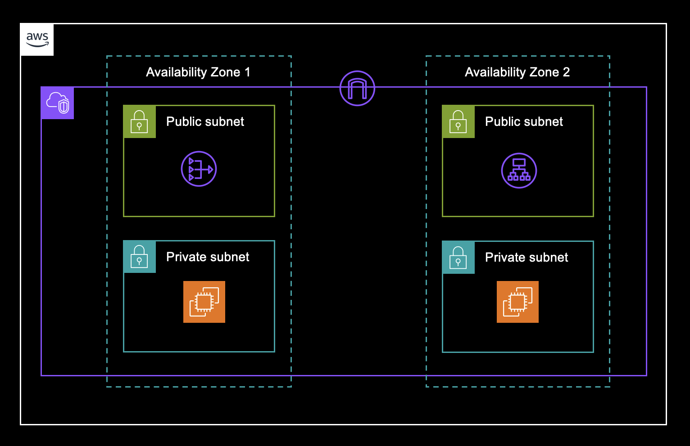

Videos I got to get inspiration from 

[Create AWS VPC with Private and Public Subnet | AWS Application Load Balancer](https://www.youtube.com/watch?v=WwoxnIy9seQ)

[Powerpoint presentation with the diagram](https://docs.google.com/presentation/d/1Y-o2nTrG92J45ERO6jSv3MxIzn26xCOO/edit?usp=sharing&ouid=110867820467780372690&rtpof=true&sd=true) 